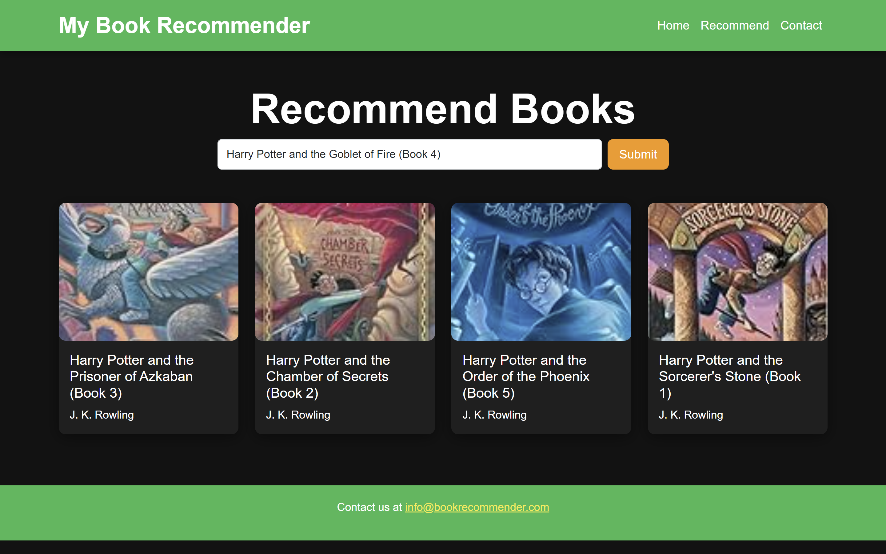

<h2>To view the demo of the website https://book-recommendation-system-el77.onrender.com</h2>

<h1>Book Recommendation System</h1>

    The <strong>Book Recommendation System</strong> is a web-based application that provides personalized book recommendations to users based on their reading preferences and behavior. The system leverages advanced techniques in <em>Collaborative Filtering</em> and <em>Natural Language Processing (NLP)</em> to analyze user behavior and recommend books that match their tastes. 
     
    The collaborative filtering approach captures the patterns of user interactions with books, while the NLP techniques analyze book descriptions and metadata to enhance the recommendation accuracy. The combination of these methods enables the system to suggest books that are both popular and closely aligned with individual user interests.

<h2>Features</h2>
<ul>
    <li>Personalized book recommendations based on user behavior.</li>
    <li>Combination of collaborative filtering and NLP for improved accuracy.</li>
    <li>User-friendly interface with search and recommendation features.</li>
    <li>Uses a content-based approach to understand book descriptions.</li>
    <li>Real-time recommendations with a lightweight backend using Flask.</li>
</ul>

<h2>Requirements</h2>
<ul>
    <li>Python 3.6 or above</li>
    <li>Flask</li>
    <li>NLTK (Natural Language Toolkit)</li>
    <li>Scikit-Learn</li>
    <li>Pandas</li>
    <li>NumPy</li>
    <li>Jinja2</li>
    <li>HTML/CSS for the frontend</li>
</ul>

<h2>Technologies Used</h2>
<ul>
    <li><strong>Flask:</strong> A lightweight web framework for the backend server.</li>
    <li><strong>NLTK:</strong> For processing natural language data and extracting meaningful insights from book descriptions.</li>
    <li><strong>Scikit-Learn:</strong> Implements collaborative filtering algorithms and machine learning models.</li>
    <li><strong>HTML/CSS:</strong> Used to design the front-end interface of the application.</li>
    <li><strong>Pandas & NumPy:</strong> For data manipulation and numerical operations.</li>
</ul>

<h2>Project Screenshot</h2>

Below is a placeholder for project screenshots. Replace the placeholder with actual screenshots of the project:

<h2>How to Run the Project</h2>
<ol>
    <li>Clone the repository:</li>
    <pre><code>git clone https://github.com/your_username/book-recommendation-system.git</code></pre>
    <li>Install the required dependencies:</li>
    <pre><code>pip install -r requirements.txt</code></pre>
    <li>Run the Flask application:</li>
    <pre><code>python app.py</code></pre>
    <li>Open a web browser and go to <a href="http://localhost:5000" target="_blank">http://localhost:5000</a> to start using the application.</li>
</ol>

<h2>Future Enhancements</h2>
<ul>
    <li>Integration with popular book APIs for real-time data updates.</li>
    <li>Adding a rating system to enhance the recommendation accuracy.</li>
    <li>Incorporating deep learning techniques for more personalized recommendations.</li>
</ul>

<h2>License</h2>

This project is licensed under the MIT License - see the <a href="LICENSE">LICENSE</a> file for details.

